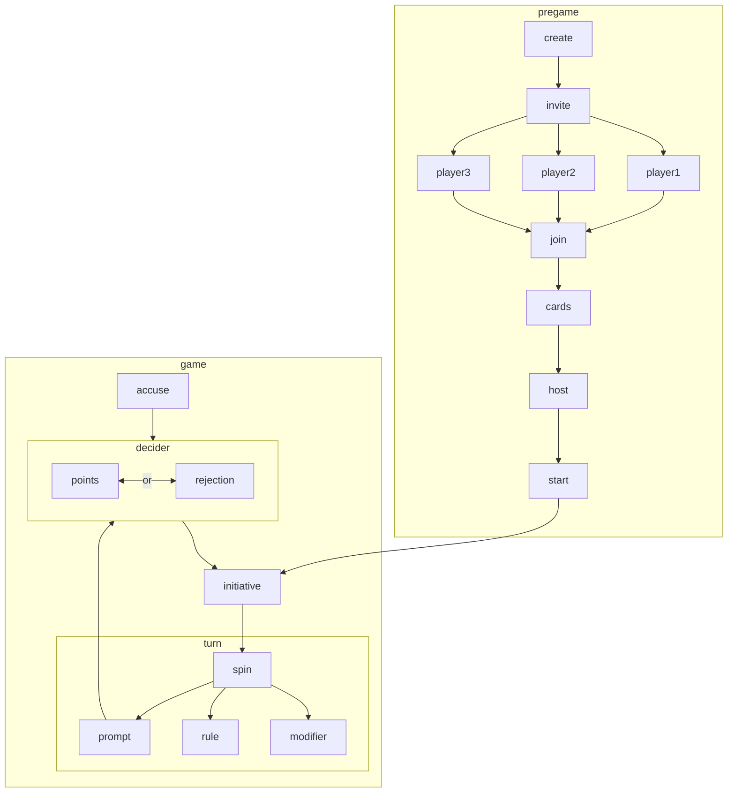

# diagrams

Basic backend design and state flow.

## game states



## routes
> [!NOTE]
> This is a pre-production outline, see route declaration in [main.go](./main.go).

    ```mermaid
flowchart LR

  subgraph pregame
    root --> create
    create --> join
    join --> frontend
  end

  subgraph data
    status
    player
    table
  end

  subgraph actions
    start
    spin
    ending
  end

  frontend -->|htmx| data
  frontend -->|post| actions
```
