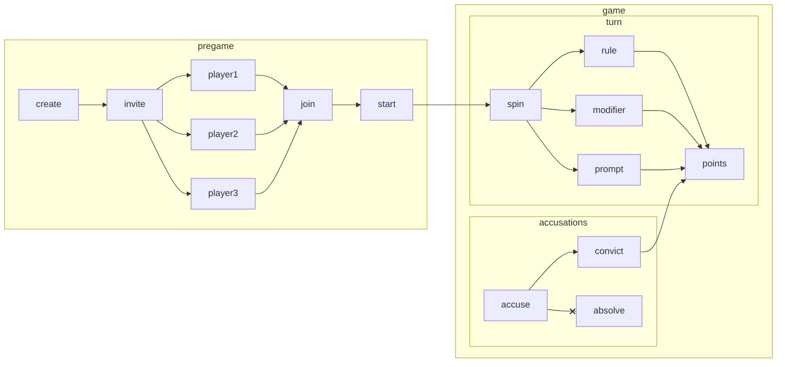
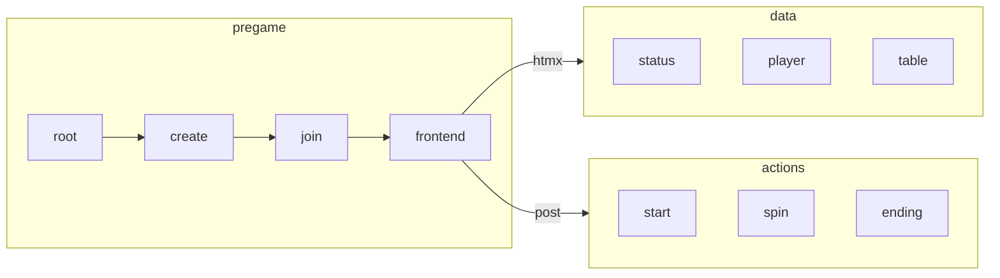

# rulette

rule stacking game based on [dropout.tv](https://dropout.tv)'s [_Rulette_ (S7E7)](https://www.dropout.tv/game-changer/season:7/videos/rulette)

---

## game states

```mermaid
flowchart LR
  subgraph pregame
    create --> invite
    invite --> player1
    invite --> player2
    invite --> player3
    player1 --> join
    player2 --> join
    player3 --> join
    join --> start
  end
  start --> spin
  subgraph game
    subgraph turn
      spin --> rule --> points
      spin --> modifier --> points
      spin --> prompt --> points
    end
    subgraph accusations
      accuse --> convict
      accuse --x absolve
    end
    convict --> points
  end
```

## routes

```mermaid
flowchart LR

  subgraph pregame
    root --> create
    create --> join
    join --> frontend
  end

  subgraph data
    status
    player
    table
  end

  subgraph actions
    start
    spin
    ending
  end

  frontend -->|htmx| data
  frontend -->|post| actions
```
