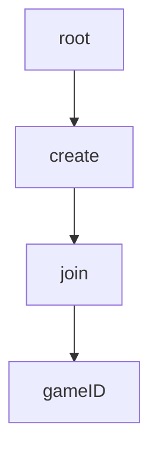
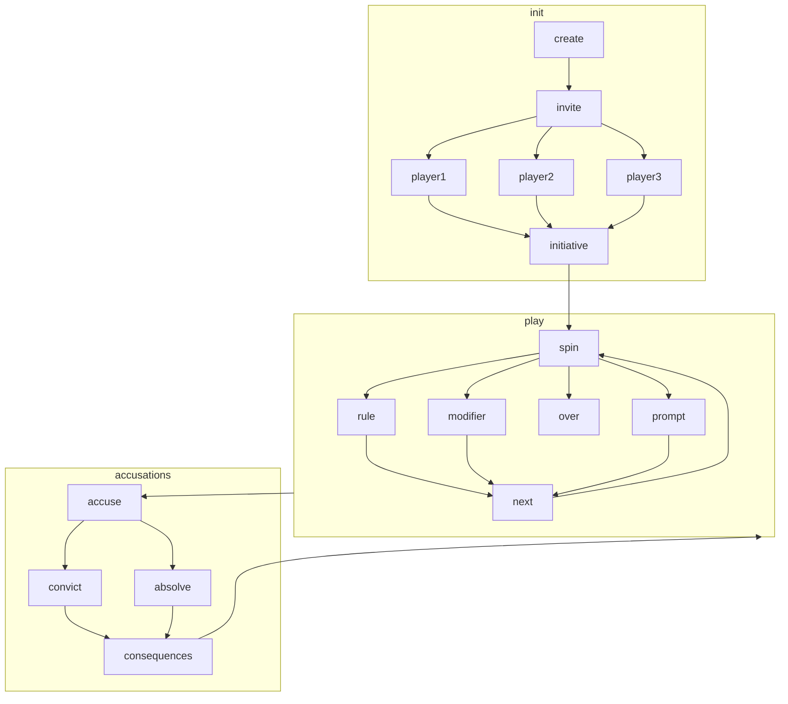

# rulette

rule stacking game based on DropoutTV's _Rulette_ from season 7

## Routes

```mermaid
flowchart TD
  root --> create
  create --> join
  join --> gameID
```

## Game States

```mermaid
flowchart TD
  subgraph init
    create --> invite
    invite --> player1
    invite --> player2
    invite --> player3
    player1 --> initiative
    player2 --> initiative
    player3 --> initiative
  end
  initiative --> spin
  subgraph play
    spin --> rule --> next
    spin --> modifier --> next
    spin --> prompt --> next
    spin --> over
    next --> spin
  end
  play ---> accuse
  subgraph accusations
    accuse --> convict --> consequences
 accuse --> absolve --> consequences
  end
  consequences ---> play
```
